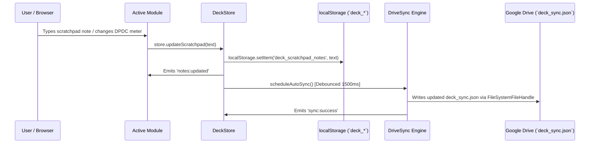

# Deck — Architecture & Modular System Design Specification

---
date: 2026-09-22
status: Approved
project: Deck
author: Antigravity & User (Pair Programming)
---

## 1. Executive Summary

**Deck** is an uncompromising, ultra-minimalist personal command center, browser start page, and daily workflow dashboard designed with a tactile Nothing Tech / Neumorphic aesthetic. 

This specification establishes a **clean-room architecture** with:
1. **Total eradication of legacy "Aura" branding**: Zero residual naming in code tokens, storage keys, manifests, or comments.
2. **Unified Single-Directory Architecture (`deck/`)**: Serves both as a zero-latency Chrome New Tab extension (`Ctrl+T`) and a local-first standalone web app/PWA, eliminating file duplication entirely.
3. **Micro-Kernel & Pluggable Module System**: Clean `mount/unmount` lifecycle contracts for all functional tabs and widgets.
4. **Future-Proof Extensibility**: Clean boundaries ready for an optional Phase 2 local desktop bridge (to launch Unreal Engine projects, 3ds Max, Photoshop, and browse local directories).

---

## 2. Directory Structure & Architecture

```
d:/AI/bookmarks-manager/
├── index.html                   # Root instant redirect to ./deck/
├── launch_dashboard.bat         # 1-click batch launcher: starts Python server for Deck
├── README.md                    # Authoritative Deck documentation
├── deck/                        # CANONICAL SINGLE SOURCE OF TRUTH
│   ├── index.html               # Clean HTML shell (Deck layout, nav, modal)
│   ├── manifest.json            # Manifest V3 for Chrome Extension (newtab override)
│   ├── deck.webmanifest         # PWA Manifest for Standalone Web App
│   ├── sw.js                    # Service Worker with `deck-cache-v1`
│   ├── css/
│   │   ├── tokens.css           # Dual-theme tokens (Carbon Obsidian & Sculpted Alabaster)
│   │   ├── layout.css           # Geometric bento grid, responsive app shell, modal
│   │   └── components.css       # Tactile neumorphic components, omnibar, buttons, badges
│   └── js/
│       ├── deck.js              # Micro-Kernel / Main Application Bootstrapper
│       ├── core/
│       │   ├── store.js         # Reactive Proxy Store (`deck_*` storage keys, EventBus)
│       │   ├── registry.js      # Pluggable Module Registry & Lifecycle Manager
│       │   ├── sync.js          # Google Drive File System Access & `deck_sync.json`
│       │   └── events.js        # Global Event Bus dispatcher
│       ├── data/
│       │   └── bookmarks.js     # Master curated bookmarks, toolbar zones, prompts
│       ├── services/
│       │   ├── search.js        # Fuzzy bookmark search engine & quick prefix router
│       │   └── weather.js       # Dhaka Open-Meteo live weather client
│       └── modules/
│           ├── command-center/  # Tab 1: Ambient clock, weather, omnibar, bento grid, notes
│           ├── studio-3d/       # Tab 2: UE5/Archviz launchers, aspect ratio & unit converters
│           ├── library/         # Tab 3: Hierarchical master bookmark explorer
│           └── utilities/       # Tab 4: DPDC smart prepaid meter, ISP self-care, reflection
```

---

## 3. Core Component Roles & Boundaries

### 3.1 Deck Micro-Kernel (`deck.js`)
* **Role**: Orchestrates application startup, theme initialization, global keyboard shortcuts (`/` for search, `F` for fullscreen, `1`-`4` for tabs), and modal bindings.
* **Responsibilities**:
  * Initializes the `DeckStore`.
  * Discovers and registers all modules from `modules/` into the `ModuleRegistry`.
  * Manages tab switching via uniform `mount()` and `unmount()` calls.
  * Registers the Service Worker on HTTP environments.

### 3.2 Reactive State Store (`core/store.js`)
* **Role**: Centralized reactive state container with namespaced persistence.
* **Storage Keys**:
  ```javascript
  const STORAGE_KEYS = {
    THEME: 'deck_theme',
    ACTIVE_TAB: 'deck_active_tab',
    SEARCH_ENGINE: 'deck_search_engine',
    SCRATCHPAD: 'deck_scratchpad_notes',
    CUSTOM_PROMPTS: 'deck_custom_prompts',
    CLOUD_CONFIG: 'deck_cloud_config',
    DPDC_BALANCE: 'deck_dpdc_balance',
    DPDC_BURN_RATE: 'deck_dpdc_burn_rate',
    DPDC_FIXED: 'deck_dpdc_fixed',
    DPDC_DATE: 'deck_dpdc_date',
    GDRIVE_FOLDER: 'deck_gdrive_folder_name'
  };
  ```
* **Reactivity**: Emits fine-grained events (`theme:changed`, `tab:changed`, `notes:updated`, `sync:status`) across subscribers.

### 3.3 Pluggable Module Contract (`core/registry.js`)
Every tab module implements a strict, lightweight interface:
```javascript
export class DeckModule {
  id: string;          // e.g. 'tab-command-center'
  title: string;       // e.g. 'Command Center'
  icon: string;        // Inline SVG markup

  async mount(container: HTMLElement, context: DeckContext): Promise<void>;
  unmount?(): void;
}
```
* **Context**: `{ store, events, searchService }` — modules do not reach into global window objects.

### 3.4 Google Drive Sync Engine (`core/sync.js`)
* **Role**: Keyless local-to-cloud synchronization.
* **Database**: IndexedDB named `deck_drive_db` (holds user-granted `FileSystemDirectoryHandle`).
* **Sync Artifact**: `deck_sync.json` written directly to the user's linked Drive folder.
* **Fallback**: 1-click **Download JSON** and **Upload JSON** buttons for manual backup.

---

## 4. Data Flow & Sync Lifecycle



---

## 5. Decision Log

- **Decision**: Rename brand exclusively to **Deck** with zero subtitles or tags.
  - **Alternatives Evaluated**: Command Deck, DeckOS, DECK // Command Center, Basestation, Origin.
  - **Rationale**: Minimalist, punchy, confident, matches tactile Nothing Tech industrial aesthetic.
  - **Trade-offs**: Requires clean UI typography to carry the brand weight without descriptive taglines.

- **Decision**: Clean slate / no legacy data shims.
  - **Alternatives Evaluated**: Legacy `aura_*` migration shims, dual sync filenames (`aura_sync.json` fallback).
  - **Rationale**: User explicitly requested a fresh, clean start with zero legacy baggage.
  - **Trade-offs**: Completely clean codebase with zero technical debt or deprecated keys.

- **Decision**: Unified single directory (`deck/`) for both Web App & Chrome Extension.
  - **Alternatives Evaluated**: Separate `dashboard/` and `extension/` folders with sync scripts.
  - **Rationale**: Completely eliminates duplicate code, duplicate CSS, and synchronization drift.
  - **Trade-offs**: `manifest.json` and web app assets live in the same root, requiring clean separation between Extension manifest and Web manifest (`deck.webmanifest`).

- **Decision**: Web-Only Modular Architecture for Phase 1; Desktop Bridge deferred to Phase 2.
  - **Alternatives Evaluated**: Bundling Python desktop bridge daemon in Phase 1; Tauri/Electron app.
  - **Rationale**: Keeps the immediate build lean and focused on 0ms browser launch, while structuring modules cleanly so desktop hooks can be dropped in without refactoring the UI.
  - **Trade-offs**: Desktop app/dir launching will be added in the subsequent phase.

---

## 6. Verification & Quality Gates

1. **Brand Audit**: `grep_search` across entire workspace for `aura` (case-insensitive) must return **0 results** in active code.
2. **Offline 0ms Launch**: Open `deck/index.html` directly in browser — loads instantaneously with all 4 tab views operational.
3. **Chrome Extension Loading**: Load `deck/` as Unpacked Extension in `chrome://extensions` — verifies clean manifest V3 loading without warnings.
4. **Theme Switcher**: Instant toggle between Carbon Obsidian (`#040405`) and Sculpted Alabaster (`#edf1f6`) with persistent state in `deck_theme`.
5. **Interactive Omnibar**: Fast fuzzy search across all bookmarks with keyboard navigation (`↑`/`↓`/`Enter`/`Esc`).
